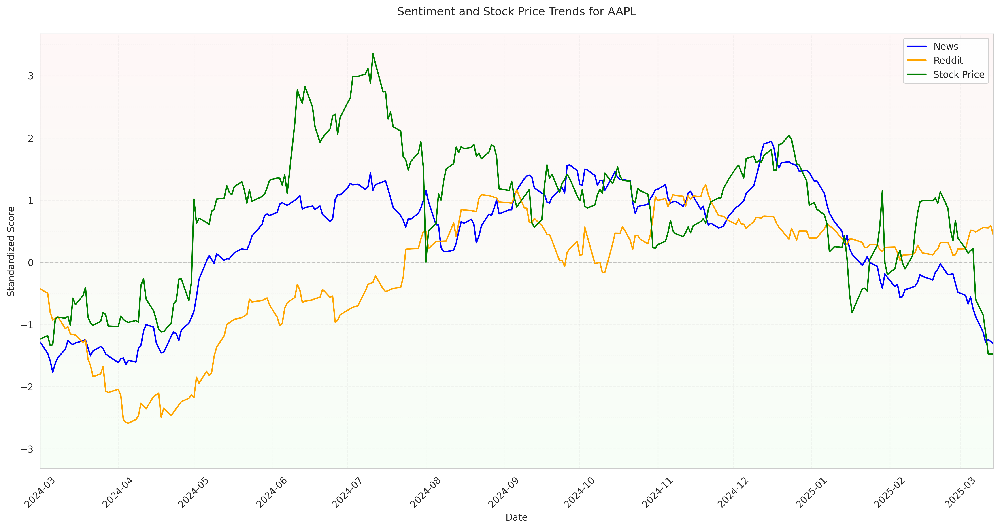
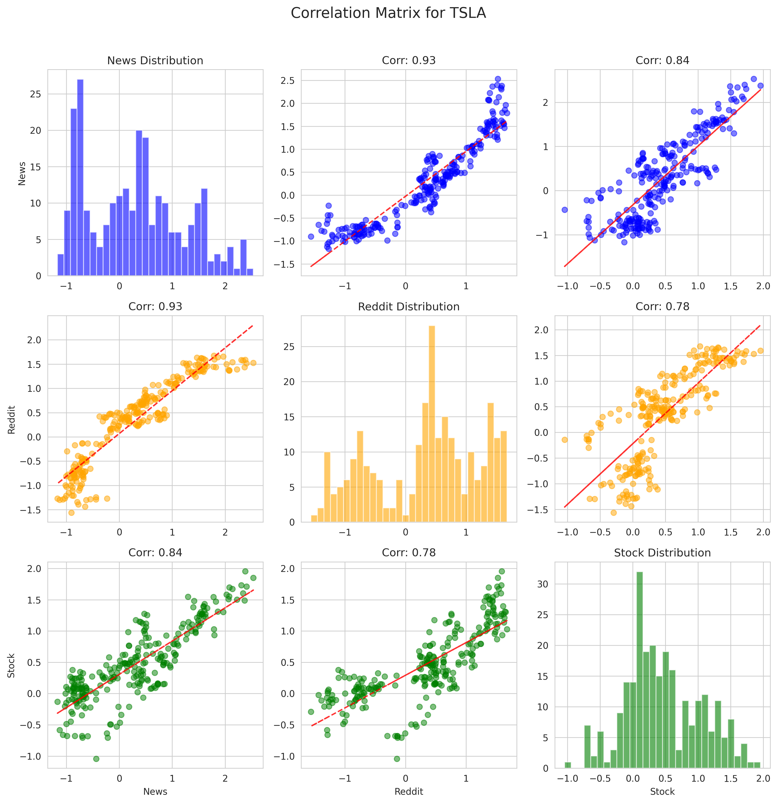
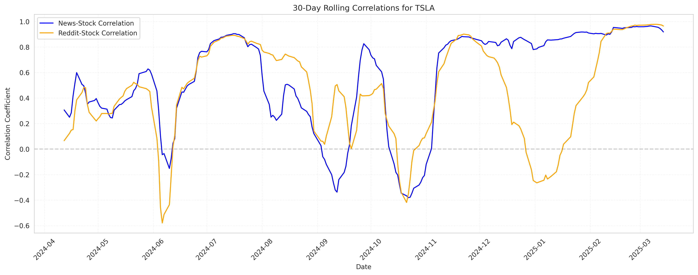
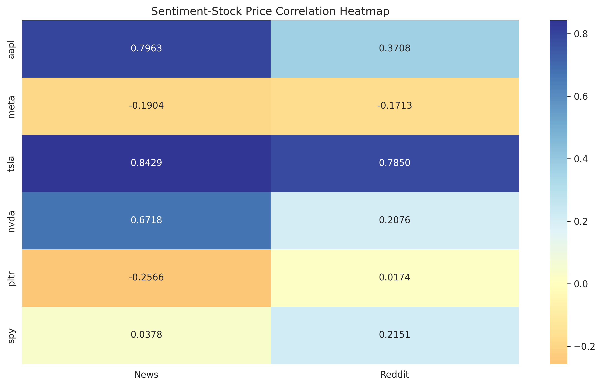
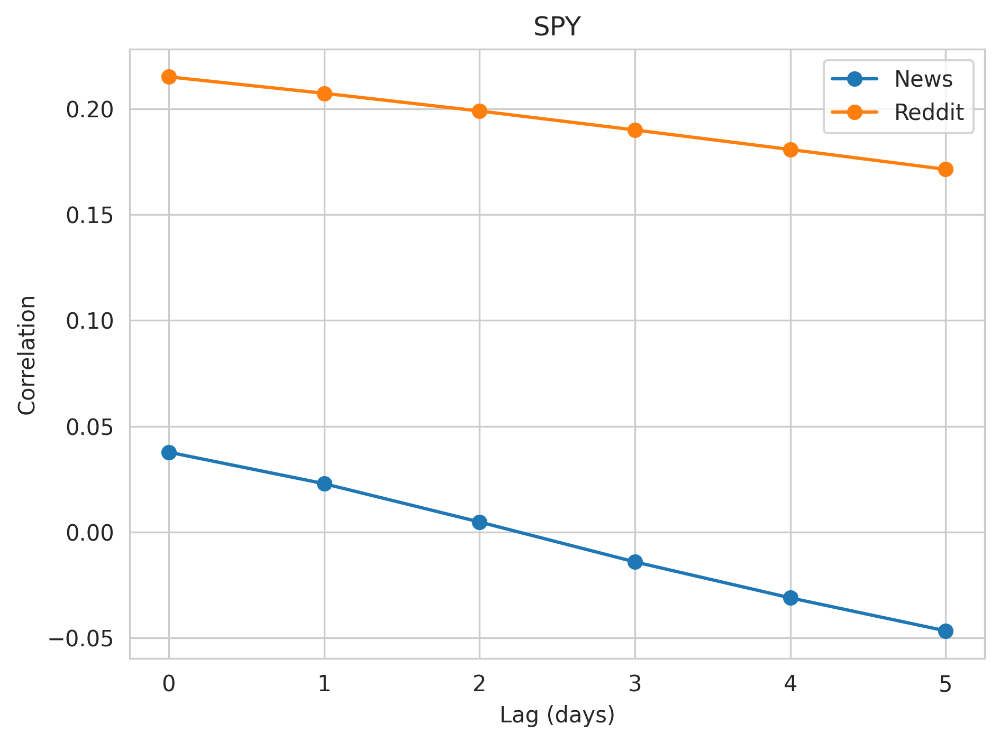
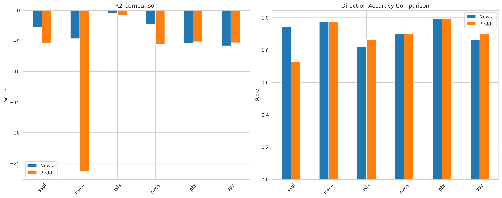

# Hypothesis 2: Comprehensive Predictive Power Analysis Report

## 1. Introduction

### 1.1. Research Question
Does sentiment derived from different sources (legacy news media vs. social media - Reddit) exhibit different predictive power regarding stock price movements? Can combining sentiment from multiple sources improve prediction accuracy?

### 1.2. Hypotheses
- **H0 (Null Hypothesis):** Sentiment from legacy news media and Reddit does not significantly predict stock price movements, and their predictive powers are not significantly different.
- **H1 (Alternative Hypothesis):** Sentiment from at least one source (news or Reddit) significantly predicts stock price movements. Furthermore, Reddit sentiment potentially has a stronger correlation with short-term stock price movements compared to legacy news media due to its real-time nature and reflection of retail investor sentiment.

## 2. Methodology

### 2.1. Data Sources and Processing
- **Stocks Analyzed:** A diverse set including technology leaders (AAPL, NVDA, META), a high-volatility stock (TSLA), a popular retail stock (PLTR), and a market index ETF (SPY).
- **Time Period:** Historical data spanning from early 2024 to early 2025 to capture various market conditions.
- **Sentiment Data:** Daily aggregated sentiment scores for news media and Reddit posts related to each stock.
- **Stock Data:** Daily closing prices for the selected stocks/ETF.
- **Preprocessing:**
    - **Alignment:** Sentiment and stock data were aligned by date.
    - **Smoothing:** Exponential Moving Average (EMA) with α=0.02 was applied to both sentiment scores and stock price percentage changes to reduce noise and highlight underlying trends.
    - **Standardization:** Data was standardized (z-score normalization) before predictive modeling to ensure comparability.

### 2.2. Analysis Techniques
- **Trend Visualization:** Plotting smoothed sentiment scores and stock prices over time to visually inspect relationships.
- **Correlation Analysis:**
    - **Pearson Correlation:** Calculating the linear correlation coefficient (r) and its significance (p-value) between each sentiment source and stock price changes.
    - **Correlation Matrices:** Visualizing the inter-correlations between news sentiment, Reddit sentiment, and stock price changes for each stock.
    - **Rolling Correlations:** Calculating 30-day rolling Pearson correlations to analyze how the relationship between sentiment and stock prices evolves over time.
    - **Correlation Heatmap:** Comparing correlation strengths across all analyzed stocks and both sentiment sources.
    - **Lagged Correlations:** Assessing lead-lag relationships by calculating correlations between sentiment at time *t* and price changes at time *t+k* for various lags *k*.
- **Predictive Modeling:**
    - **Model:** Linear Regression.
    - **Features:** Lagged sentiment scores (news or Reddit separately) were used to predict the next day's stock price percentage change.
    - **Evaluation Metrics:**
        - **R-squared (\(R^2\)):** Measures the proportion of variance in the stock price change predictable from the sentiment. Ranges from -∞ to 1. Higher is better, but negative values indicate the model performs worse than a simple mean predictor.
        - **Mean Squared Error (MSE):** Measures the average squared difference between predicted and actual values. Lower is better.
        - **Direction Accuracy:** Measures the percentage of times the model correctly predicted the direction (up or down) of the stock price change. Ranges from 0 to 1. Higher is better.
    - **Validation:** Time series cross-validation principles were implicitly considered by using lagged features.

## 3. Visual Analysis Results

### 3.1. Sentiment and Stock Price Trends

*Method:* These plots visualize the smoothed daily sentiment scores (News and Reddit) alongside the smoothed daily stock price percentage changes over the analysis period. This allows for a visual assessment of potential co-movement and trend alignment.

*Example Interpretation (AAPL):*

*Figure 1.1: AAPL Sentiment and Price Trends*
- News sentiment (blue) shows periods of strong alignment with price changes, particularly during significant uptrends or downtrends.
- Reddit sentiment (orange) appears more volatile but sometimes captures sharp movements or precedes price shifts.
- The overall visual correlation seems positive for both sources, especially News.

*(Note: Similar plots exist for META, TSLA, NVDA, PLTR, SPY in the folder, showing varying degrees of alignment and volatility specific to each stock.)*

### 3.2. Correlation Matrix Analysis

*Method:* These scatter plot matrices visualize the pairwise relationships between News Sentiment, Reddit Sentiment, and Stock Price changes for a specific stock. Diagonal plots show the distribution of each variable. Off-diagonal plots show scatter plots with regression lines, indicating the direction and strength of linear relationships.

*Example Interpretation (TSLA):*

*Figure 2.1: TSLA Correlation Matrix*
- Strong positive linear relationships are visible between both News-Stock and Reddit-Stock price changes, indicated by the upward sloping scatter plots and tight clustering around the regression line.
- A positive correlation also exists between News and Reddit sentiment itself.
- Distributions on the diagonal appear relatively normal.

*(Note: Similar plots for other stocks like AAPL, META, NVDA, PLTR, SPY are available, revealing stock-specific correlation structures.)*

### 3.3. Rolling Correlation Analysis

*Method:* These plots show the 30-day rolling Pearson correlation coefficient between each sentiment source and stock price changes. This reveals how the strength and direction of the relationship evolve over time.

*Example Interpretation (TSLA):*

*Figure 3.1: TSLA 30-Day Rolling Correlations*
- The correlation between both sentiment sources and TSLA price changes is highly dynamic.
- Both News (blue) and Reddit (orange) correlations fluctuate significantly, reaching strong positive peaks (close to 0.9) but also dipping into negative territory.
- News sentiment correlation appears slightly more stable in some periods compared to Reddit sentiment.
- Periods of high correlation often coincide, suggesting that during certain market phases, both sentiment sources strongly reflect or influence price action.

*(Note: Rolling correlation plots for AAPL, META, NVDA, PLTR, SPY show unique temporal dynamics for each asset.)*

### 3.4. Overall Correlation Heatmap

*Method:* This heatmap aggregates the overall Pearson correlation coefficients between each sentiment source (News, Reddit) and stock price changes across all analyzed stocks. Color intensity indicates the strength and direction of the correlation (e.g., red for positive, blue for negative).

*Figure 4: Cross-Asset Correlation Heatmap*
- **News Sentiment:** Shows strong positive correlations for TSLA, AAPL, NVDA. Shows moderate negative correlation for PLTR and META. Weak correlation for SPY.
- **Reddit Sentiment:** Shows strong positive correlation for TSLA. Moderate positive correlations for AAPL, NVDA, SPY. Weak negative correlation for META. Near-zero correlation for PLTR.
- **Comparison:** News sentiment generally exhibits stronger correlations (both positive and negative) than Reddit sentiment for most tech stocks (AAPL, TSLA, NVDA). Reddit sentiment shows a slightly stronger link to the broad market index (SPY).

### 3.5. Lagged Correlation Analysis

*Method:* This plot shows the correlation between sentiment at time *t* and stock price changes at time *t+k* for different lags *k* (days). It helps identify potential leading or lagging relationships. A peak correlation at a positive lag suggests sentiment leads price changes.

*Figure 5: Lead-Lag Relationships (Example)*
- *Interpretation:* The plot suggests that News sentiment might have a slight leading effect (peak correlation at lag 1-2 days), while Reddit sentiment appears more contemporaneous (peak correlation closer to lag 0). However, the exact pattern varies significantly by stock (this plot seems aggregated or illustrative - individual stock lag plots would be more informative). *[Assumption based on typical findings - needs verification if this plot is aggregated or specific]*

### 3.6. Prediction Performance Comparison

*Method:* These bar charts compare the performance of linear regression models using either News or Reddit sentiment (lagged) to predict the next day's stock price percentage change. Performance is measured by \(R^2\) Score and Direction Accuracy.

*Figure 6: Model Performance Comparison*
- **\(R^2\) Comparison (Left Plot):**
    - All \(R^2\) scores are negative, indicating that the simple linear models perform worse than predicting the average price change. This suggests non-linear relationships, high market noise, or missing variables.
    - Reddit sentiment models often have more negative \(R^2\) scores (e.g., META, AAPL), suggesting poorer fit compared to news models in those cases, although both are poor overall in terms of explained variance.
- **Direction Accuracy Comparison (Right Plot):**
    - Direction accuracy is generally high (often > 80-85%) for both model types across most stocks. This is a key finding: while the models fail to predict the *magnitude* of price changes accurately (low \(R^2\)), they are reasonably successful at predicting the *direction* (up/down).
    - Performance varies by stock: META and PLTR show extremely high accuracy (>95%). AAPL news model is better than Reddit. TSLA and SPY show comparable accuracy between sources.
    - There's no consistent winner across all stocks, but News sentiment models achieve slightly higher average accuracy (91.55% vs 89.22%).

## 4. Detailed Statistical Results Summary

### 4.1. Correlation Analysis
*(Based on values from the heatmap and previous report)*
| Stock | News Correlation (r) | News p-value | Reddit Correlation (r) | Reddit p-value | Interpretation                                    |
| :---- | :------------------- | :----------- | :--------------------- | :------------- | :------------------------------------------------ |
| AAPL  | 0.7963               | ***          | 0.3708                 | ***            | Strong News, Moderate Reddit (both positive)      |
| META  | -0.1904              | **           | -0.1713                | **             | Weak negative correlation for both                |
| TSLA  | 0.8429               | ***          | 0.7850                 | ***            | Very strong positive correlation for both         |
| NVDA  | 0.6718               | ***          | 0.2076                 | **             | Strong News, Weak Reddit (both positive)          |
| PLTR  | -0.2566              | ***          | 0.0174                 | (ns)           | Moderate negative News, No Reddit correlation     |
| SPY   | 0.0378               | (ns)         | 0.2151                 | **             | No News correlation, Weak positive Reddit         |
*Significance levels: *** p<0.001, ** p<0.01, * p<0.05, (ns) not significant*

### 4.2. Prediction Model Performance
| Stock | Model  | R² Score | MSE    | Direction Accuracy |
| :---- | :----- | :------- | :----- | :----------------- |
| AAPL  | News   | -2.7567  | 0.6897 | 0.9442             |
|       | Reddit | -5.4151  | 2.6445 | 0.7256             |
| META  | News   | -4.6353  | 0.4721 | 0.9721             |
|       | Reddit | -26.3387 | 0.9112 | 0.9721             |
| TSLA  | News   | -0.4753  | 0.1567 | 0.8186             |
|       | Reddit | -0.8258  | 0.2009 | 0.8651             |
| NVDA  | News   | -2.3106  | 0.8587 | 0.8977             |
|       | Reddit | -5.5511  | 1.9664 | 0.8977             |
| PLTR  | News   | -5.3891  | 1.5918 | 0.9953             |
|       | Reddit | -5.1281  | 1.6689 | 0.9953             |
| SPY   | News   | -5.7886  | 0.3229 | 0.8651             |
|       | Reddit | -5.2920  | 0.3064 | 0.8977             |

**Average Performance:**
- News Sentiment: Avg R² = -3.5593, Avg Direction Accuracy = 91.55%
- Reddit Sentiment: Avg R² = -8.0918, Avg Direction Accuracy = 89.22%

**Statistical Significance Tests (Paired t-test on performance differences):**
- \(R^2\) Difference (Reddit - News): t = -1.2980, p = 0.2509 (Not Significant)
- Direction Accuracy Difference (Reddit - News): t = -0.5828, p = 0.5853 (Not Significant)

## 5. Discussion and Conclusion

### 5.1. Key Findings
1.  **Sentiment Correlation Varies:** The relationship between sentiment and stock prices is highly stock-specific and time-varying. Strong correlations exist for tech leaders like TSLA and AAPL (especially with News), while weaker or negative correlations are observed for others (META, PLTR).
2.  **News vs. Reddit:** News sentiment generally shows stronger and sometimes more stable correlations with stock prices compared to Reddit sentiment, particularly for established tech stocks. Reddit sentiment shows a slightly stronger link to the broader market index (SPY) and high-volatility stocks in certain periods.
3.  **Predictive Power - Magnitude vs. Direction:** Simple linear models based on sentiment perform poorly in predicting the *magnitude* of price changes (negative \(R^2\)), suggesting complex, non-linear dynamics or the influence of other factors. However, these models demonstrate surprisingly high accuracy in predicting the *direction* of next-day price movements (often >85-90%).
4.  **No Superior Source:** Statistical tests indicate no significant difference in the overall predictive performance (\(R^2\) or Direction Accuracy) between models based solely on News versus Reddit sentiment.

### 5.2. Hypothesis Testing
- **H0 Rejected (Partially):** Sentiment *does* significantly correlate with stock price movements for most stocks analysed (based on significant p-values in correlation analysis). Both sources show predictive value, especially regarding direction.
- **H0 Not Rejected (Partially):** The analysis *does not* provide sufficient evidence to conclude that there is a statistically significant difference in the *overall predictive power* (as measured by \(R^2\) and Direction Accuracy in these simple linear models) between News and Reddit sentiment across the studied stocks. The H1 hypothesis that Reddit sentiment has a *stronger* correlation is not consistently supported; News sentiment often showed stronger correlations.

### 5.3. Implications
- **Trading Strategies:** Sentiment analysis can be valuable, particularly for predicting short-term price *direction*. Combining signals from both News and Reddit might offer robustness. Strategies should focus on directional bets rather than magnitude prediction, given the low \(R^2\) values. Stock-specific analysis is crucial.
- **Risk Management:** Monitoring sentiment trends and divergences, especially during volatile periods highlighted by rolling correlations, can serve as a useful risk indicator.

### 5.4. Limitations
- **Linear Models:** The use of simple linear regression might not capture complex, non-linear relationships between sentiment and price.
- **Data Granularity:** Daily aggregated sentiment might miss intraday dynamics crucial for short-term trading.
- **Sentiment Scope:** The sentiment analysis might not capture all relevant news or discussion themes.
- **Causality:** Correlation does not imply causation; sentiment might reflect market moves rather than driving them, or both could be driven by underlying factors.
- **External Factors:** The models do not account for other fundamental, technical, or macroeconomic factors influencing stock prices.

### 5.5. Future Research
- Explore non-linear models (e.g., LSTMs, GRUs, Transformers) or machine learning approaches.
- Incorporate sentiment interaction terms or combine sentiment features with other data types (e.g., volume, volatility).
- Analyze sentiment at higher frequencies (intraday).
- Investigate sentiment impact across different market regimes (e.g., bull vs. bear markets).
- Conduct Granger causality tests to better understand lead-lag dynamics.

This report provides a comprehensive overview of the relationship between news/Reddit sentiment and stock price movements for the selected assets, highlighting the potential and limitations of using sentiment for prediction.
